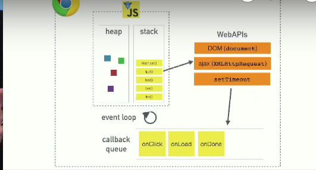

#Phillip Roberts: What the heck is the event loop anyway?

Java Script es un lenguaje de programación asíncrono, no bloqueante y concurrente.
JS es un lenguaje de programacion de un solo hilo, tiene una call stack y sólo puede hacer una cosa a la vez.

##Event loop
El trabajo del event loop es el de revisar la stack y el stack queue y si el stack esta vacío toma lo primero que este en el que y lo coloca en el stack.

##Callbacks

Pueden ser una de las dos siguientes cosas: 
		  
* cualquier función que llame a otra función
* Una callback asíncrona que posteriormente será colocada en la callback queue.

> Written with [StackEdit](https://stackedit.io/).
